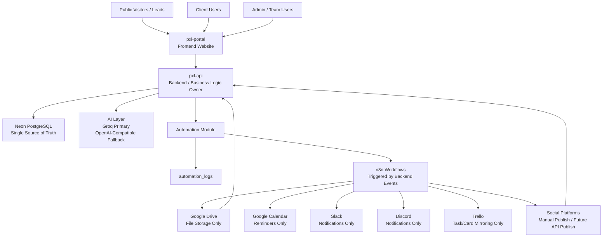
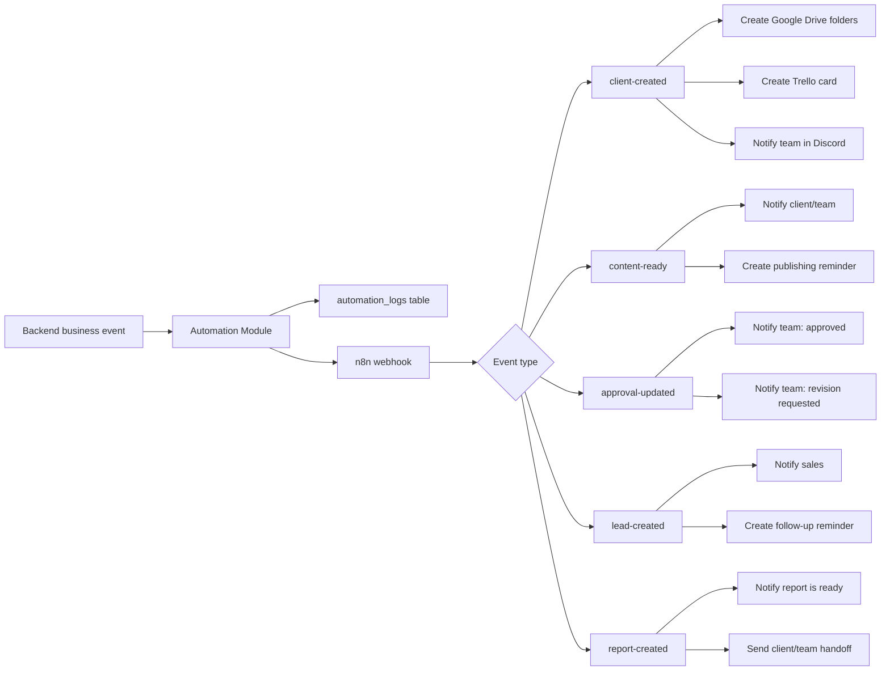
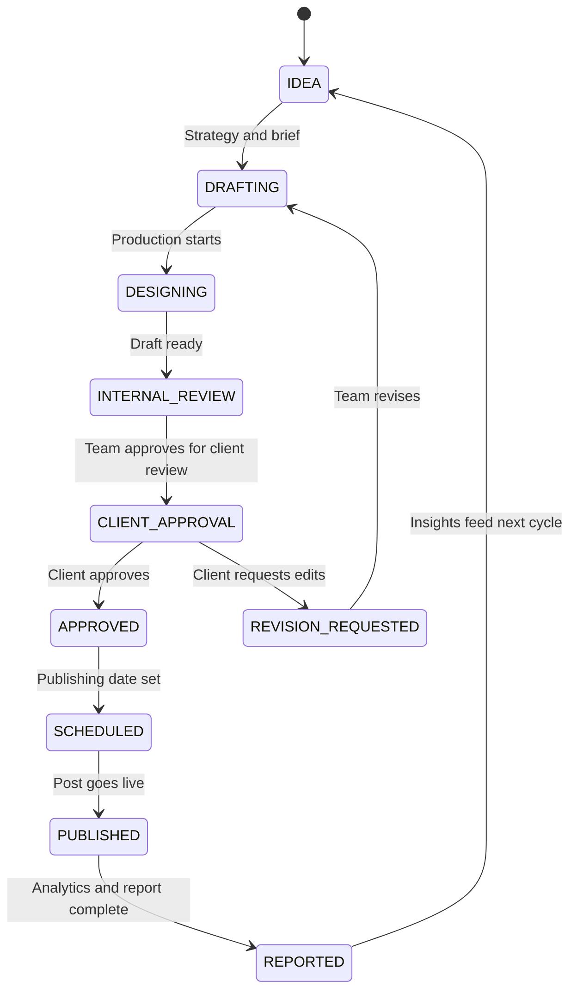

# PXL Automation

PXL Automation is a centralized AI-assisted operations platform for a digital marketing agency.

Its purpose is to help the agency reduce repetitive work, centralize client operations, improve content workflow visibility, standardize reporting, and scale delivery without replacing human creativity, strategy, or client relationships.

## What This Means In Plain English

PXL Automation is the agency's shared operations hub.

Instead of client details, files, content tasks, approvals, reminders, and reports being scattered across chat, spreadsheets, folders, and separate apps, this system keeps the important information connected in one workflow.

The system helps with:

- Client onboarding
- Lead capture
- Content planning
- Content production
- Caption and hashtag drafting
- Reels and video scripting
- Client approvals
- Revision tracking
- Publishing reminders
- Analytics tracking
- Report preparation
- File organization
- Team notifications
- AI-assisted operations

## Core Principle

```text
Automation prepares, routes, records, reminds, and drafts.
Humans decide, create, review, approve, publish, and build relationships.
```

This platform does not replace the marketing team. It removes repetitive operations around the team so people can focus on strategy, creativity, client communication, and final decisions.

## Quick Explanation For Non-Technical Teams

| Term | Simple Meaning |
| --- | --- |
| Portal | The website/dashboard people log in to use |
| Backend | The rule keeper behind the scenes that saves data and connects tools |
| Database | The official filing cabinet for all important records |
| API | The controlled way the portal talks to the backend |
| AI | A drafting assistant for captions, briefs, scripts, hashtags, and summaries |
| n8n | The automation runner that handles repeated tasks |
| Webhook | A signal sent when something important happens |
| Role-based access | Different users see different things based on their role |
| Asset | A file such as a logo, graphic, video, reel, report, or brand document |
| Source of truth | The official place where correct data is stored |

## Repository Structure

| Repository | Purpose | Stack |
| --- | --- | --- |
| `pxl-api` | Backend API, database access, business rules, AI calls, automation events | NestJS, TypeScript, Drizzle ORM, Neon PostgreSQL, JWT |
| `pxl-portal` | Admin portal, client portal, public onboarding form, public lead form | Next.js, TypeScript, Tailwind CSS, React Query, Axios, Zustand |
| `pxl-n8n-workflows` | Importable workflow automations | n8n workflow JSON |

## System Architecture

Plain-English version:

- People use the portal.
- The portal asks the backend to save or load information.
- The backend checks the rules and talks to the database.
- The database is the official record.
- When something important happens, the backend triggers n8n.
- n8n creates folders, sends reminders, and notifies the team.
- AI is only called from the backend, never from the frontend.



## Ownership Rules

- Neon PostgreSQL is the single source of truth.
- The backend owns all business logic.
- The frontend only displays screens and sends API requests.
- AI keys are never exposed to the frontend.
- n8n only reacts to backend-triggered events.
- Google Drive stores files only.
- Slack and Discord are for notifications only.
- Google Calendar is for scheduling and reminders only.
- Trello mirrors tasks/cards only.
- Social platforms are publishing destinations and metric sources, not the operational source of truth.

## Main Connected Workflow

Plain-English version:

1. A lead or client submits a form.
2. The system saves the information.
3. Automation creates folders, tasks, reminders, and notifications.
4. The team plans content.
5. AI helps draft ideas, captions, briefs, hashtags, and scripts.
6. The team creates and reviews the work.
7. The client approves or requests revisions.
8. The team schedules and publishes.
9. Analytics are collected.
10. Reports are created.
11. Insights guide the next month of content.



## Detailed Human vs Automation Workflow

This diagram shows where humans do the work and where the system helps.

```mermaid
flowchart TD
  A["Public visitor or prospective client"] --> B{"Entry point"}

  B --> C["Lead form"]
  B --> D["Onboarding form"]

  C --> E["Automation: save lead to database"]
  E --> F["Automation: notify sales in Slack/Discord"]
  F --> G["Automation: create follow-up reminder"]
  G --> H["Human: qualify lead, contact prospect, prepare proposal"]
  H --> I{"Lead won?"}
  I -->|Yes| D
  I -->|No| J["Human: close or nurture lead"]

  D --> K["Automation: save client onboarding data"]
  K --> L["Automation: create Google Drive folder structure"]
  L --> M["Automation: create Trello onboarding card"]
  M --> N["Automation: notify team"]
  N --> O["Human: review onboarding answers and clarify missing details"]

  O --> P["Human: define strategy, goals, offers, content pillars"]
  P --> Q["Automation: AI drafts content ideas and creative briefs"]
  Q --> R["Human: edit strategy and approve monthly direction"]

  R --> S["Human: create content tasks and production plan"]
  S --> T["Automation: track content status and due dates"]
  T --> U["Human: design graphics, edit videos, produce reels, prepare assets"]
  U --> V["Automation: store file references and versions from Google Drive"]

  V --> W{"Needs AI support?"}
  W -->|Caption| X["Automation: generate captions, CTAs, hashtags, SEO text, Taglish variants"]
  W -->|Reel or video| Y["Automation: generate hook, scenes, overlay text, CTA, B-roll ideas"]
  W -->|Brief| Z["Automation: generate creative brief draft"]
  W -->|No| AA["Human: continue production"]

  X --> AB["Human: polish caption and brand voice"]
  Y --> AC["Human: refine script and edit video"]
  Z --> AD["Human: adjust brief for real strategy"]
  AA --> AE["Human: internal review"]
  AB --> AE
  AC --> AE
  AD --> AE

  AE --> AF{"Internal review passed?"}
  AF -->|No| U
  AF -->|Yes| AG["Automation: move content to client approval"]
  AG --> AH["Automation: notify client/team"]

  AH --> AI["Human client: review preview, caption, hashtags, platform, schedule"]
  AI --> AJ{"Client decision"}

  AJ -->|Approve| AK["Automation: save approval and update status"]
  AJ -->|Request revision| AL["Automation: save feedback and increment revision count"]
  AL --> AM["Human: interpret feedback and revise content"]
  AM --> AE

  AK --> AN["Human: final publish check"]
  AN --> AO["Automation: create Google Calendar publishing reminder"]
  AO --> AP["Human: publish manually to social platforms for MVP"]
  AP --> AQ["Automation: update content status to published"]

  AQ --> AR["Automation: collect or import analytics metrics"]
  AR --> AS["Automation: update dashboards"]
  AS --> AT["Automation: AI drafts analytics summary and recommendations"]
  AT --> AU["Human: review insights and write final recommendations"]
  AU --> AV["Automation: create report record and store Drive report URL"]
  AV --> AW["Automation: notify client/team report is ready"]
  AW --> AX["Human: discuss results with client"]
  AX --> AY["Human + Automation: feed insights into next month strategy"]
  AY --> P
```



```mermaid
flowchart LR
  Lead["Lead Form"] --> Leads["Leads Module"]
  Leads --> Qualify["Human: Qualify Lead"]
  Qualify --> Onboarding["Client Onboarding"]

  Onboarding --> Clients["Clients Module"]
  Clients --> Strategy["Human: Content Strategy"]
  Strategy --> Briefs["AI: Briefs / Ideas"]
  Briefs --> Production["Human: Content Production"]

  Production --> Captions["AI: Captions / Hashtags / Reel Scripts"]
  Captions --> Review["Human: Internal Review"]
  Review --> Approval["Client Approval"]

  Approval -->|Approved| Publishing["Publishing Reminder / Schedule"]
  Approval -->|Revision Requested| Production

  Publishing --> Published["Manual Publish / Future API Publish"]
  Published --> Analytics["Analytics Import"]
  Analytics --> Reports["AI-Assisted Reports"]
  Reports --> Strategy
```

## Human vs Automation Responsibilities

| Area | Human Work | Automation Work |
| --- | --- | --- |
| Lead generation | Qualify leads, contact prospects, prepare proposals, close deals | Capture lead form, save lead, notify sales, create follow-up reminder |
| Client onboarding | Review business context, clarify missing details, decide kickoff priorities | Save onboarding data, create Drive folders, create Trello card, notify team |
| Strategy | Define content pillars, offers, campaign direction, monthly priorities | Draft ideas, summarize inputs, create first-pass briefs |
| Production | Design graphics, edit videos, produce reels, polish creative assets | Track statuses, manage task records, store asset links and versions |
| Captions | Edit tone, brand voice, message clarity, final CTA | Generate captions, hashtags, SEO text, CTA options, Taglish variants |
| Reels and video | Choose hook, refine script, shoot/edit video, approve final cut | Generate script drafts, scene flow, overlay text, B-roll ideas |
| Approvals | Review content, approve, request revisions, interpret feedback | Route approvals, save feedback, track revision count, notify team |
| Publishing | Final publish check and MVP manual publishing | Create calendar reminders, update publishing status, log workflow events |
| Analytics | Interpret results and make strategic decisions | Store metrics, update dashboards, draft AI insights |
| Reporting | Finalize recommendations and client narrative | Generate report draft, save report URL, notify client/team |
| File management | Decide asset usage and organize final deliverables | Create folder structure, store Drive references, track versions |

## Automation Event Flow

Plain-English version:

- The backend notices that something important happened.
- The backend records the event.
- The backend sends the event to n8n.
- n8n performs the repetitive external actions.



## What Each Team Does

| Team / Role | Main Responsibilities |
| --- | --- |
| Sales / Client Success | Qualify leads, onboard clients, clarify business details, maintain relationships |
| Strategy Team | Define goals, offers, content pillars, monthly direction, campaign priorities |
| Content Team | Write, edit, polish captions, prepare content plans, coordinate approvals |
| Design Team | Create graphics, carousels, brand assets, and production-ready visuals |
| Video / Reels Team | Script, shoot, edit, review, and finalize reels or short-form videos |
| Publishing Team | Final checks, scheduling, manual publishing, platform coordination |
| Reporting Team | Review analytics, prepare recommendations, explain performance to clients |
| Clients | Review content, approve posts, request revisions, review reports |
| Automation / System | Save data, create folders, send reminders, track statuses, draft AI outputs |

## Backend: `pxl-api`

The backend is the system behind the scenes. It handles rules, permissions, data validation, database writes, automation events, and AI provider calls.

### Backend Stack

- NestJS
- TypeScript
- Drizzle ORM
- Neon PostgreSQL
- REST API
- JWT authentication
- Role guards
- dotenv
- class-validator
- class-transformer
- Groq/OpenAI-compatible AI calls

### Backend Modules

- `auth`
- `users`
- `clients`
- `content`
- `approvals`
- `assets`
- `leads`
- `analytics`
- `reports`
- `automation`
- `ai`
- `notifications`
- `calendar`
- `integrations`

### Core API Areas

- `POST /auth/login`
- `POST /auth/register`
- `GET /auth/me`
- `/clients`
- `/content`
- `/approvals`
- `/assets`
- `/leads`
- `/analytics`
- `/reports`
- `/automation/*`
- `/ai/generate-caption`
- `/ai/generate-brief`
- `/ai/generate-reel-script`
- `/ai/generate-report-summary`
- `/ai/generate-hashtags`

## Frontend: `pxl-portal`

The frontend is the website people use. It does not contain secret keys or business rules. It simply shows screens and sends requests to the backend.

### Admin Pages

- `/admin/dashboard`
- `/admin/clients`
- `/admin/clients/[id]`
- `/admin/content`
- `/admin/content/[id]`
- `/admin/approvals`
- `/admin/calendar`
- `/admin/leads`
- `/admin/reports`
- `/admin/analytics`

### Client Pages

- `/client/dashboard`
- `/client/approvals`
- `/client/assets`
- `/client/reports`

### Public Pages

- `/onboarding`
- `/lead-form`
- `/login`

## Database

The database is the official record of the business workflow. If information needs to be trusted later, it should be saved here through the backend.

### Main Tables

- `users`
- `clients`
- `content_items`
- `content_tasks`
- `approvals`
- `assets`
- `leads`
- `analytics`
- `reports`
- `automation_logs`
- `notifications`
- `calendar_events`

### Content Lifecycle



## Automation: `pxl-n8n-workflows`

n8n handles repeated operational tasks after the backend triggers an event.

### Automation Events

- `client-created`
- `content-ready`
- `approval-updated`
- `lead-created`
- `report-created`
- `monthly-report-schedule`

### Automation Examples

- Client onboarding creates Google Drive folders, Trello cards, and Discord notifications.
- Content ready events notify the team/client and prepare publishing reminders.
- Approval updates notify the team when content is approved or needs revision.
- Lead creation notifies sales and creates a follow-up reminder.
- Report creation notifies the team/client that reports are ready.

## Google Drive Folder Structure

Google Drive stores files only. The backend stores the Drive links and file references.

```text
PXL Clients/
  Client Name/
    01 Brand Assets/
    02 Monthly Content/
    03 Reels/
    04 Graphics/
    05 Approved/
    06 Published/
    07 Reports/
```

## Roles

| Role | Description |
| --- | --- |
| `ADMIN` | Full system access and operational control |
| `TEAM` | Internal production, strategy, approval, reporting, and client management access |
| `CLIENT` | Client-facing access to approvals, assets, reports, and dashboards |

## MVP Flow

1. A lead submits the public lead form.
2. The backend saves the lead and triggers sales notifications.
3. A qualified lead becomes a client.
4. The client submits onboarding information.
5. The backend saves the client and triggers n8n.
6. n8n creates Google Drive folders, Trello cards, and notifications.
7. The team creates content strategy and content items.
8. AI assists with briefs, captions, hashtags, and reel scripts.
9. The team reviews and sends content for client approval.
10. The client approves or requests revisions.
11. Approved content is scheduled and published.
12. Analytics are imported or entered.
13. AI assists with report summaries and recommendations.
14. Reports are delivered to the client.
15. Analytics and report insights feed the next month's strategy.

## Current Status

The MVP scaffold includes:

- Separate backend and frontend repositories
- Drizzle database schema
- Seed script
- REST API modules
- JWT auth structure
- RBAC guard structure
- Admin/client/public frontend routes
- Reusable UI components
- Axios API client
- React Query provider
- Zustand UI store
- Importable n8n workflow JSON
- Root project checklist
- Human vs automation workflow documentation

Still required before production:

- Install dependencies
- Configure Neon PostgreSQL
- Run migrations
- Configure real environment variables
- Import and activate n8n workflows
- Attach Google, Trello, Slack, and Discord credentials
- Connect forms and dashboards to live data
- Add tests
- Harden authentication and client-specific data access
- Deploy frontend and backend
- Run a full production-like workflow test

## Deployment Targets

| Layer | Recommended Host |
| --- | --- |
| Frontend | Vercel |
| Backend | Railway or Render |
| Database | Neon PostgreSQL |
| Automation | n8n Cloud or self-hosted n8n |
| Files | Google Drive |

## Strategic Direction

PXL Automation should remain a centralized operations layer. The system should help the team move faster, reduce duplicated work, standardize delivery, and make reporting easier while keeping strategy, taste, client judgment, and creative quality in human hands.

