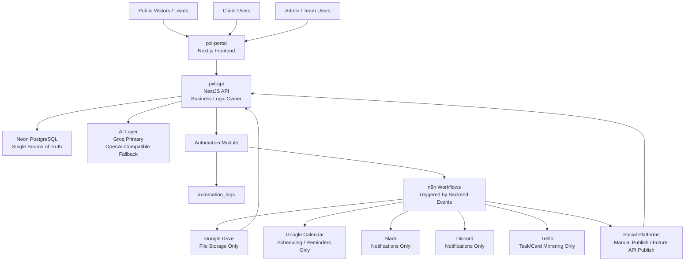
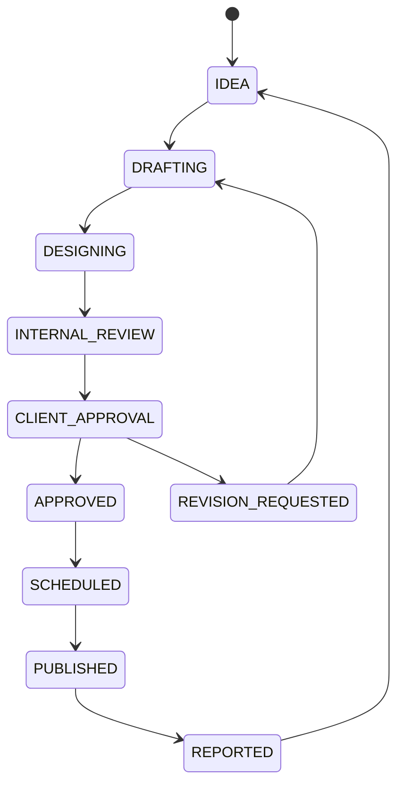

# PXL Automation

PXL Automation is a centralized AI-assisted operations platform for a digital marketing agency. It is designed to reduce repetitive operational work, centralize client and content workflows, improve reporting consistency, and help the team scale without replacing human creativity, strategy, or client relationships.

The platform supports the full digital marketing operations lifecycle:

- Client onboarding
- Content strategy
- Content production
- Reels and video planning
- Caption, CTA, hashtag, and brief generation
- Client approvals and revision tracking
- Publishing reminders
- Analytics collection
- Lead generation and internal CRM workflows
- File and asset management
- AI-assisted reporting
- Centralized dashboards
- n8n automation triggers
- Role-based access for admin, team, and clients

## Core Principle

```text
Automation prepares, routes, records, reminds, and drafts.
Humans decide, create, review, approve, publish, and build relationships.
```

PXL Automation is not meant to replace creative work or social platforms. It acts as an operations layer around the agency’s existing tools and workflows.

## Repository Structure

| Repository | Purpose | Stack |
| --- | --- | --- |
| `pxl-api` | Backend API and business logic | NestJS, TypeScript, Drizzle ORM, Neon PostgreSQL, JWT |
| `pxl-portal` | Admin, client, and public portal | Next.js, TypeScript, Tailwind CSS, React Query, Axios, Zustand |
| `pxl-n8n-workflows` | Importable automation workflows | n8n workflow JSON |

## System Architecture



## Ownership Rules

- Neon PostgreSQL is the single source of truth.
- The backend owns all business logic.
- The frontend only displays UI and sends API requests.
- AI keys are never exposed to the frontend.
- n8n reacts to backend events through webhooks.
- Google Drive stores files only.
- Slack and Discord send notifications only.
- Google Calendar stores reminders only.
- Trello mirrors tasks/cards only.
- Social platforms are publishing destinations and metric sources, not the operational source of truth.

## Main Workflow

```mermaid
flowchart LR
  Lead["Lead Form"] --> Leads["Leads Module"]
  Leads --> Qualify["Human: Qualify Lead"]
  Qualify --> Onboarding["Client Onboarding"]

  Onboarding --> Clients["Clients Module"]
  Clients --> Strategy["Human: Content Strategy"]
  Strategy --> Briefs["AI: Briefs / Ideas"]
  Briefs --> Production["Human: Content Production"]

  Production --> Captions["AI: Captions / Hashtags / Reel Scripts"]
  Captions --> Review["Human: Internal Review"]
  Review --> Approval["Client Approval"]

  Approval -->|Approved| Publishing["Publishing Reminder / Schedule"]
  Approval -->|Revision Requested| Production

  Publishing --> Published["Manual Publish / Future API Publish"]
  Published --> Analytics["Analytics Import"]
  Analytics --> Reports["AI-Assisted Reports"]
  Reports --> Strategy
```



## Human vs Automation Responsibilities

| Area | Human Work | Automation Work |
| --- | --- | --- |
| Lead generation | Qualify leads, contact prospects, prepare proposals, close deals | Capture lead form, save lead, notify sales, create follow-up reminder |
| Client onboarding | Review business context, clarify missing details, decide kickoff priorities | Save onboarding data, create Drive folders, create Trello card, notify team |
| Strategy | Define content pillars, offers, campaign direction, monthly priorities | Draft ideas, summarize inputs, create first-pass briefs |
| Production | Design graphics, edit videos, produce reels, polish creative assets | Track statuses, manage task records, store asset links and versions |
| Captions | Edit tone, brand voice, message clarity, final CTA | Generate captions, hashtags, SEO text, CTA options, Taglish variants |
| Reels and video | Choose hook, refine script, shoot/edit video, approve final cut | Generate script drafts, scene flow, overlay text, B-roll ideas |
| Approvals | Review content, approve, request revisions, interpret feedback | Route approvals, save feedback, track revision count, notify team |
| Publishing | Final publish check and MVP manual publishing | Create calendar reminders, update publishing status, log workflow events |
| Analytics | Interpret results and make strategic decisions | Store metrics, update dashboards, draft AI insights |
| Reporting | Finalize recommendations and client narrative | Generate report draft, save report URL, notify client/team |

## Backend: `pxl-api`

The backend is a modular NestJS API responsible for authentication, business logic, data validation, database writes, automation events, and AI provider calls.

### Backend Stack

- NestJS
- TypeScript
- Drizzle ORM
- Neon PostgreSQL
- REST API
- JWT authentication
- Role guards
- dotenv
- class-validator
- class-transformer
- Groq/OpenAI-compatible AI calls

### Backend Modules

- `auth`
- `users`
- `clients`
- `content`
- `approvals`
- `assets`
- `leads`
- `analytics`
- `reports`
- `automation`
- `ai`
- `notifications`
- `calendar`
- `integrations`

### Core API Areas

- `POST /auth/login`
- `POST /auth/register`
- `GET /auth/me`
- `/clients`
- `/content`
- `/approvals`
- `/assets`
- `/leads`
- `/analytics`
- `/reports`
- `/automation/*`
- `/ai/generate-caption`
- `/ai/generate-brief`
- `/ai/generate-reel-script`
- `/ai/generate-report-summary`
- `/ai/generate-hashtags`

## Frontend: `pxl-portal`

The frontend is a Next.js portal for internal users, client users, and public form submissions. It does not contain business logic or secrets. All data is fetched through the backend API.

### Frontend Stack

- Next.js App Router
- TypeScript
- Tailwind CSS
- React Query
- Axios
- Zustand

### Admin Pages

- `/admin/dashboard`
- `/admin/clients`
- `/admin/clients/[id]`
- `/admin/content`
- `/admin/content/[id]`
- `/admin/approvals`
- `/admin/calendar`
- `/admin/leads`
- `/admin/reports`
- `/admin/analytics`

### Client Pages

- `/client/dashboard`
- `/client/approvals`
- `/client/assets`
- `/client/reports`

### Public Pages

- `/onboarding`
- `/lead-form`
- `/login`

## Database

The database is hosted on Neon PostgreSQL and managed with Drizzle ORM.

### Main Tables

- `users`
- `clients`
- `content_items`
- `content_tasks`
- `approvals`
- `assets`
- `leads`
- `analytics`
- `reports`
- `automation_logs`
- `notifications`
- `calendar_events`

### Content Lifecycle



## Automation: `pxl-n8n-workflows`

n8n handles operational automation through backend-triggered webhooks.

### Automation Events

- `client-created`
- `content-ready`
- `approval-updated`
- `lead-created`
- `report-created`
- `monthly-report-schedule`

### Automation Examples

- Client onboarding creates Google Drive folders, Trello cards, and Discord notifications.
- Content ready events notify the team/client and prepare publishing reminders.
- Approval updates notify the team when content is approved or needs revision.
- Lead creation notifies sales and creates a follow-up reminder.
- Report creation notifies the team/client that reports are ready.

## Google Drive Folder Structure

```text
PXL Clients/
  Client Name/
    01 Brand Assets/
    02 Monthly Content/
    03 Reels/
    04 Graphics/
    05 Approved/
    06 Published/
    07 Reports/
```

Google Drive stores files only. The backend stores Drive folder IDs, file IDs, URLs, asset versions, and metadata in Neon PostgreSQL.

## Roles

| Role | Description |
| --- | --- |
| `ADMIN` | Full system access and operational control |
| `TEAM` | Internal production, strategy, approval, reporting, and client management access |
| `CLIENT` | Client-facing access to approvals, assets, reports, and dashboards |

## MVP Flow

1. A lead submits the public lead form.
2. The backend saves the lead and triggers sales notifications.
3. A qualified lead becomes a client.
4. The client submits onboarding information.
5. The backend saves the client and triggers n8n.
6. n8n creates Google Drive folders, Trello cards, and notifications.
7. The team creates content strategy and content items.
8. AI assists with briefs, captions, hashtags, and reel scripts.
9. The team reviews and sends content for client approval.
10. The client approves or requests revisions.
11. Approved content is scheduled and published.
12. Analytics are imported or entered.
13. AI assists with report summaries and recommendations.
14. Reports are delivered to the client.
15. Analytics and report insights feed the next month’s strategy.

## Current Status

The MVP scaffold includes:

- Separate backend and frontend repositories
- Drizzle database schema
- Seed script
- REST API modules
- JWT auth structure
- RBAC guard structure
- Admin/client/public frontend routes
- Reusable UI components
- Axios API client
- React Query provider
- Zustand UI store
- Importable n8n workflow JSON
- Root project checklist
- Human vs automation workflow documentation

Still required before production:

- Install dependencies
- Configure Neon PostgreSQL
- Run migrations
- Configure real environment variables
- Import and activate n8n workflows
- Attach Google, Trello, Slack, and Discord credentials
- Connect forms and dashboards to live data
- Add tests
- Harden authentication and client-specific data access
- Deploy frontend and backend
- Run a full production-like workflow test

## Deployment Targets

| Layer | Recommended Host |
| --- | --- |
| Frontend | Vercel |
| Backend | Railway or Render |
| Database | Neon PostgreSQL |
| Automation | n8n Cloud or self-hosted n8n |
| Files | Google Drive |

## Strategic Direction

PXL Automation should remain a centralized operations layer. The system should help the team move faster, reduce duplicated work, standardize delivery, and make reporting easier while keeping strategy, taste, client judgment, and creative quality in human hands.

