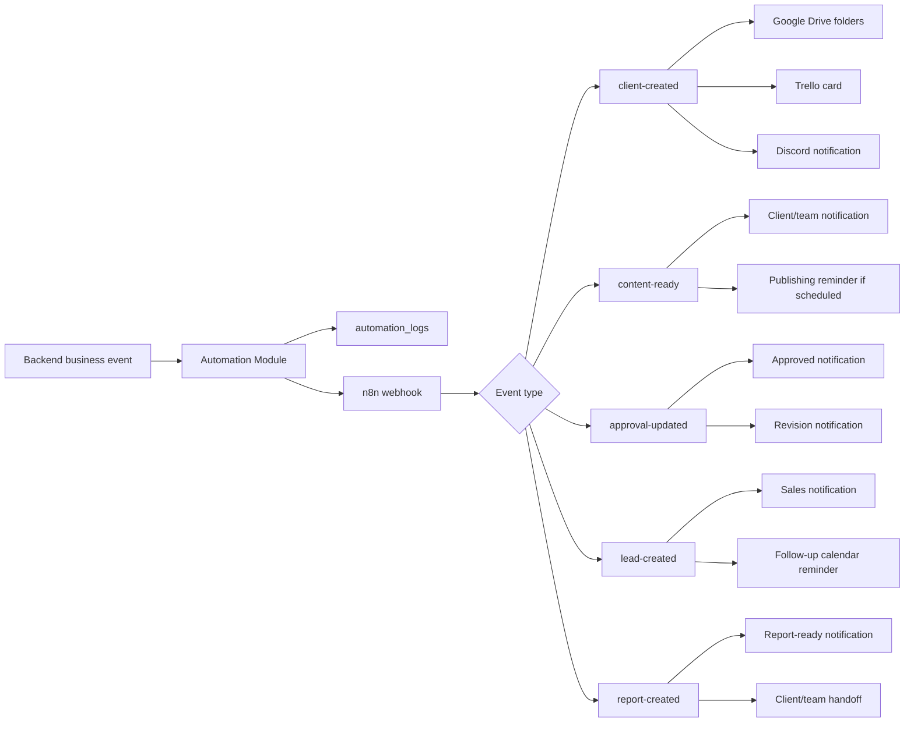
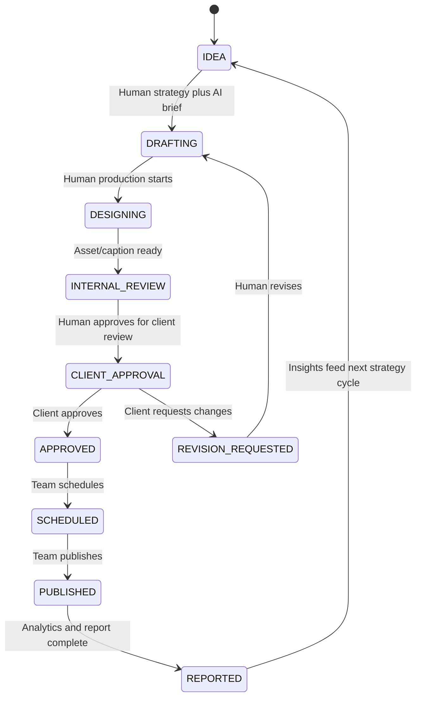

# Human vs Automation Workflow

This diagram shows where humans do the work and where PXL Automation handles repeatable workflow tasks.

## Operating Principle

```text
Automation prepares, routes, records, reminds, and drafts.
Humans decide, create, review, approve, publish, and build relationships.
```

## End-to-End Workflow

```mermaid
flowchart TD
  A["Public visitor or prospective client"] --> B{"Entry point"}

  B --> C["Lead form"]
  B --> D["Onboarding form"]

  C --> E["Automation: save lead to database"]
  E --> F["Automation: notify sales in Slack/Discord"]
  F --> G["Automation: create follow-up reminder"]
  G --> H["Human: qualify lead, contact prospect, prepare proposal"]
  H --> I{"Lead won?"}
  I -->|Yes| D
  I -->|No| J["Human: close or nurture lead"]

  D --> K["Automation: save client onboarding data"]
  K --> L["Automation: create Google Drive folder structure"]
  L --> M["Automation: create Trello onboarding card"]
  M --> N["Automation: notify team"]
  N --> O["Human: review onboarding answers and clarify missing details"]

  O --> P["Human: define strategy, goals, offers, content pillars"]
  P --> Q["Automation: AI drafts content ideas and creative briefs"]
  Q --> R["Human: edit strategy and approve monthly direction"]

  R --> S["Human: create content tasks and production plan"]
  S --> T["Automation: track content status and due dates"]
  T --> U["Human: design graphics, edit videos, produce reels, prepare assets"]
  U --> V["Automation: store file references and versions from Google Drive"]

  V --> W{"Needs AI support?"}
  W -->|Caption| X["Automation: generate captions, CTAs, hashtags, SEO text, Taglish variants"]
  W -->|Reel or video| Y["Automation: generate hook, scenes, overlay text, CTA, B-roll ideas"]
  W -->|Brief| Z["Automation: generate creative brief draft"]
  W -->|No| AA["Human: continue production"]

  X --> AB["Human: polish caption and brand voice"]
  Y --> AC["Human: refine script and edit video"]
  Z --> AD["Human: adjust brief for real strategy"]
  AA --> AE["Human: internal review"]
  AB --> AE
  AC --> AE
  AD --> AE

  AE --> AF{"Internal review passed?"}
  AF -->|No| U
  AF -->|Yes| AG["Automation: move content to client approval"]
  AG --> AH["Automation: notify client/team"]

  AH --> AI["Human client: review content preview, caption, hashtags, platform, schedule"]
  AI --> AJ{"Client decision"}

  AJ -->|Approve| AK["Automation: save approval and update status to APPROVED"]
  AJ -->|Request revision| AL["Automation: save feedback, increment revision count, update status"]
  AL --> AM["Human: interpret feedback and revise content"]
  AM --> AE

  AK --> AN["Human: final publish check"]
  AN --> AO["Automation: create Google Calendar publishing reminder"]
  AO --> AP["Human: publish manually to social platforms for MVP"]
  AP --> AQ["Automation: update content status to PUBLISHED"]

  AQ --> AR["Automation: collect or import analytics metrics"]
  AR --> AS["Automation: update dashboards"]
  AS --> AT["Automation: AI drafts analytics summary and recommendations"]
  AT --> AU["Human: review insights and write final recommendations"]
  AU --> AV["Automation: create report record and store Drive report URL"]
  AV --> AW["Automation: notify client/team report is ready"]
  AW --> AX["Human: discuss results with client"]
  AX --> AY["Human + Automation: feed insights into next month strategy"]
  AY --> P
```



## Workflow Responsibility Map

| Workflow Area | Human Work | Automation Work |
| --- | --- | --- |
| Lead generation | Qualify leads, contact prospects, prepare proposals, close deals | Capture lead form, save to CRM, notify sales, create follow-up reminder |
| Client onboarding | Review client context, clarify missing details, decide kickoff priorities | Save onboarding form, create Drive folders, create Trello card, notify team |
| Strategy | Define content pillars, offers, campaign direction, monthly priorities | Draft content ideas, summarize inputs, create first-pass creative briefs |
| Production | Design graphics, edit videos, create reels, polish creative assets | Track status, manage task records, store asset links and versions |
| Captions | Edit tone, brand voice, message clarity, final CTA | Generate caption drafts, hashtags, SEO text, CTA options, Taglish variants |
| Reels and video | Choose hook, refine script, shoot/edit video, approve final cut | Generate script draft, scene flow, overlay suggestions, B-roll ideas |
| Internal review | Judge quality, check brand fit, request fixes | Move status, track tasks, preserve revision history |
| Client approval | Approve or request revision, provide feedback | Route approval, save feedback, notify team, update statuses |
| Publishing | Final check, manual publishing for MVP | Schedule reminders, update publishing status, log workflow events |
| Analytics | Interpret results, decide strategic changes | Store metrics, update dashboards, draft AI insights |
| Reporting | Finalize client narrative and recommendations | Generate report draft, save report URL, notify client/team |
| File management | Organize final deliverables and decide asset usage | Create folder structure, store Drive references, track versions |

## Automation Event Flow



## Status Lifecycle



