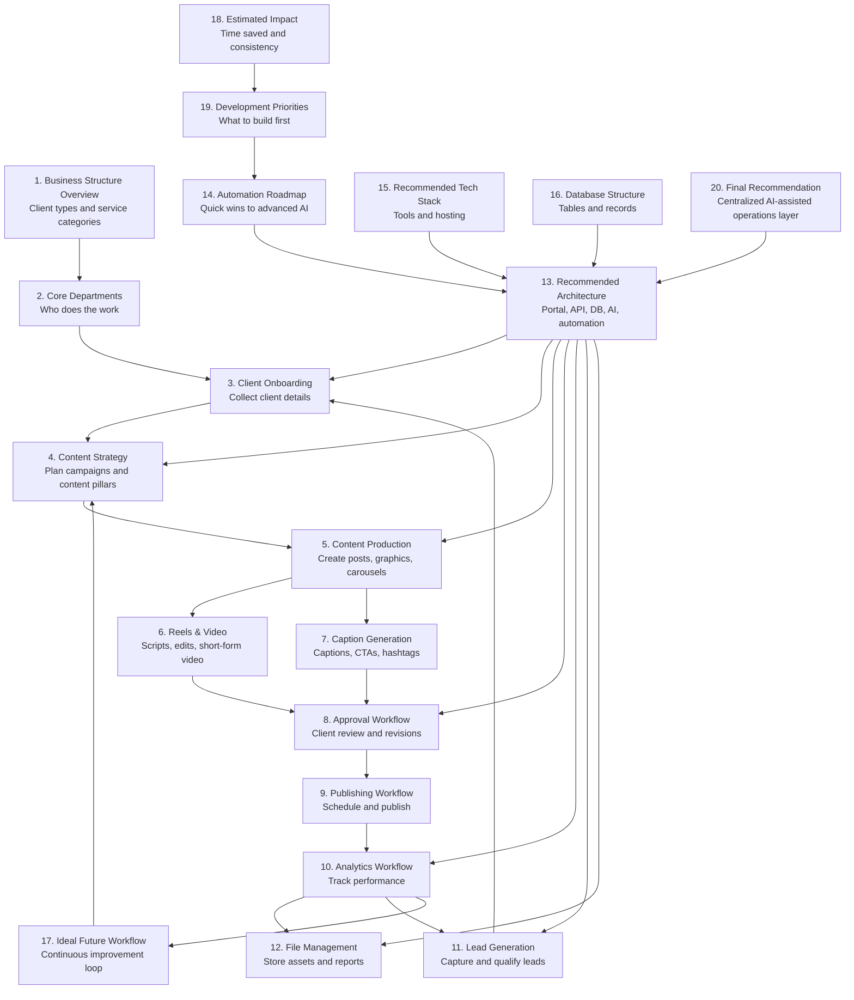
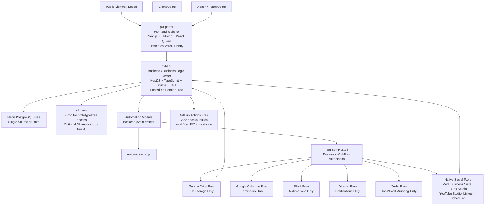
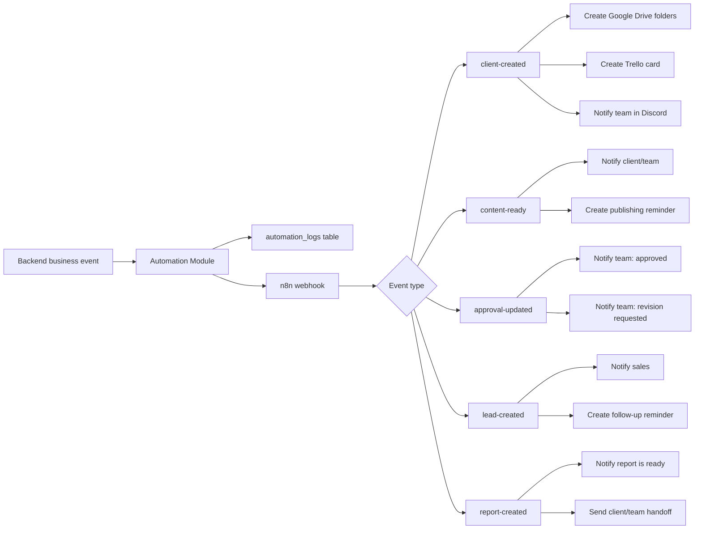
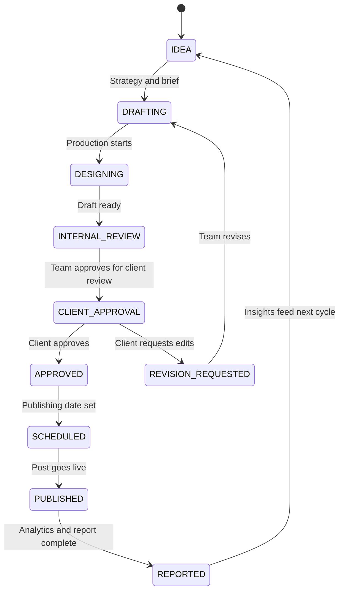

# PXL Automation

PXL Automation is a centralized AI-assisted operations platform for a digital marketing agency.

Its purpose is to help the agency reduce repetitive work, centralize client operations, improve content workflow visibility, standardize reporting, and scale delivery without replacing human creativity, strategy, or client relationships.

## What This Means In Plain English

PXL Automation is the agency's shared operations hub.

Instead of client details, files, content tasks, approvals, reminders, and reports being scattered across chat, spreadsheets, folders, and separate apps, this system keeps the important information connected in one workflow.

The system helps with:

- Client onboarding
- Lead capture
- Content planning
- Content production
- Caption and hashtag drafting
- Reels and video scripting
- Client approvals
- Revision tracking
- Publishing reminders
- Analytics tracking
- Report preparation
- File organization
- Team notifications
- AI-assisted operations

## Core Principle

```text
Automation prepares, routes, records, reminds, and drafts.
Humans decide, create, review, approve, publish, and build relationships.
```

This platform does not replace the marketing team. It removes repetitive operations around the team so people can focus on strategy, creativity, client communication, and final decisions.

## Quick Explanation For Non-Technical Teams

| Term | Simple Meaning |
| --- | --- |
| Portal | The website/dashboard people log in to use |
| Backend | The rule keeper behind the scenes that saves data and connects tools |
| Database | The official filing cabinet for all important records |
| API | The controlled way the portal talks to the backend |
| AI | A drafting assistant for captions, briefs, scripts, hashtags, and summaries |
| n8n | The automation runner that handles repeated tasks |
| Webhook | A signal sent when something important happens |
| Role-based access | Different users see different things based on their role |
| Asset | A file such as a logo, graphic, video, reel, report, or brand document |
| Source of truth | The official place where correct data is stored |

## Workflow Study Overview

The system is based on the 20-part workflow study for PXL Digital Marketing operations.

Each section below explains one part of the agency workflow in plain language and how it connects to the platform.

1. **Business Structure Overview**
   - Describes the types of clients PXL supports, such as IT, restaurants, real estate, hospitality, local services, and B2B brands.
   - In the system, this connects to client profiles, industries, services, and account status.

2. **Core Departments**
   - Defines the agency areas involved in delivery: client management, strategy, production, publishing, and performance monitoring.
   - In the system, this connects to role-based access, dashboards, assignments, content tasks, approvals, analytics, and reports.

3. **Client Onboarding Workflow**
   - Covers how a new client submits business details, goals, social links, brand notes, and file references.
   - In the system, this connects to the onboarding form, clients table, Google Drive folders, Trello cards, and team notifications.

4. **Content Strategy Workflow**
   - Covers content pillars, monthly planning, trend research, and campaign direction.
   - In the system, this connects to content ideas, creative briefs, AI-assisted planning, and the beginning of the content lifecycle.

5. **Content Production Workflow**
   - Covers the creation of graphics, carousels, stories, posts, and other content assets.
   - In the system, this connects to content tasks, asset tracking, Google Drive file references, and production statuses.

6. **Reels & Video Workflow**
   - Covers reel scripts, editing flow, captioning, B-roll suggestions, and short-form video production.
   - In the system, this connects to reel/video content types, AI reel script generation, and video asset tracking.

7. **Caption Generation Workflow**
   - Covers SEO captions, Taglish adaptation, CTA generation, hashtag recommendations, and caption drafting.
   - In the system, this connects to the AI module, caption fields, hashtags, CTA fields, and team editing.

8. **Approval Workflow**
   - Covers centralized review, client approvals, revision requests, feedback, and reminders.
   - In the system, this connects to approval pages, approval status, revision count, client feedback, and approval notifications.

9. **Publishing Workflow**
   - Covers scheduling, cross-platform publishing, hashtag handling, and best-time posting support.
   - In the system, this connects to scheduled dates, publishing reminders, Google Calendar, and published content status.

10. **Analytics Workflow**
    - Covers performance tracking, engagement monitoring, dashboards, AI insights, and reporting.
    - In the system, this connects to analytics records, dashboards, metrics, AI summaries, and reports.

11. **Lead Generation Workflow**
    - Covers lead capture, CRM tracking, qualification, and follow-up.
    - In the system, this connects to the public lead form, leads table, Slack notifications, calendar follow-ups, and client conversion.

12. **File Management System**
    - Covers centralized file storage, searchable assets, version control, and file organization.
    - In the system, this connects to Google Drive, assets, versions, client folders, content files, approved files, and report files.

13. **Recommended System Architecture**
    - Defines the main technical structure: frontend portal, backend API, database, AI layer, and automation engine.
    - In the system, this maps to `pxl-portal`, `pxl-api`, Neon PostgreSQL, Groq/OpenAI-compatible AI, and n8n.

14. **Automation Roadmap**
    - Organizes automation into quick wins, content automation, and more advanced AI phases.
    - In the system, this connects to n8n workflows, AI services, automation logs, and future automation improvements.

15. **Recommended Tech Stack**
    - Defines the tools used to build and host the platform.
    - In the system, this includes Next.js, NestJS, TypeScript, Drizzle ORM, Neon PostgreSQL, n8n, Groq, Vercel, and Railway/Render.

16. **Database Structure**
    - Defines the tables needed to store clients, content, analytics, assets, users, approvals, leads, reports, and automation logs.
    - In the system, this connects to the Drizzle schema and Neon PostgreSQL database.

17. **Ideal Future Workflow**
    - Shows the optimized end-to-end workflow from client requests to content, analytics, and reporting.
    - In the system, this is the full lifecycle loop from onboarding to strategy to production to approval to publishing to reporting.

18. **Estimated Impact**
    - Describes expected improvements such as reduced repetitive work, faster scaling, and more consistent delivery.
    - In the system, this connects to future metrics like time saved, approval turnaround, content throughput, and reporting speed.

19. **Development Priorities**
    - Identifies the highest-ROI features to build first: onboarding automation, content assistants, approvals, analytics dashboards, and publishing tools.
    - In the system, this connects to MVP implementation order and the project checklist.

20. **Final Recommendation**
    - Recommends building a centralized operations layer powered by AI-assisted workflows, without replacing human strategy or creativity.
    - In the system, this is the guiding principle for the whole platform.

## Workflow Study Map

This diagram shows how the 20 workflow-study sections connect to one another.



## Repository Structure

| Folder | Purpose | Stack |
| --- | --- | --- |
| `pxl-api` | Backend API, database access, business rules, AI calls, automation events | NestJS, TypeScript, Drizzle ORM, Neon PostgreSQL, JWT |
| `pxl-portal` | Admin portal, client portal, public onboarding form, public lead form | Next.js, TypeScript, Tailwind CSS, React Query, Axios, Zustand |
| `pxl-n8n-workflows` | Importable workflow automations | n8n workflow JSON |
| `docs` | Planning, standards, architecture, and workflow documentation | Markdown |

## User Manual

For the full operating guide, see [docs/user-manual.md](docs/user-manual.md).

## System Architecture

Plain-English version:

- People use the portal.
- The portal asks the backend to save or load information.
- The backend checks the rules and talks to the database.
- The database is the official record.
- When something important happens, the backend triggers n8n.
- n8n creates folders, sends reminders, and notifies the team.
- AI is only called from the backend, never from the frontend.

Tools used in this architecture:

- Frontend: Next.js, Tailwind CSS, React Query, Axios, Zustand, Vercel Hobby
- Backend: NestJS, TypeScript, Drizzle ORM, JWT, Render Free
- Database: Neon PostgreSQL Free
- Automation: n8n self-hosted, GitHub Actions
- AI: Groq free/prototype access, optional Ollama local AI
- Files: Google Drive Free
- Notifications: Slack Free, Discord Free
- Scheduling: Google Calendar Free
- Project mirroring: Trello Free
- Diagrams/docs: Eraser.io Free, GitHub Markdown, Google Docs



## Free Tools By Workflow

| Workflow Area | Free / Free-Tier Tools |
| --- | --- |
| Planning and diagrams | GitHub Markdown, Eraser.io Free, Google Docs, Google Sheets |
| Frontend portal | Next.js, Tailwind CSS, React Query, Axios, Zustand, Vercel Hobby |
| Backend API | NestJS, TypeScript, Drizzle ORM, JWT, Render Free |
| Database | Neon PostgreSQL Free |
| Code automation | GitHub Actions Free |
| Business automation | n8n self-hosted |
| AI assistance | Groq prototype/free access, optional Ollama local AI |
| Client onboarding | PXL Portal, n8n, Google Drive Free, Trello Free, Discord Free |
| Lead generation | PXL Portal, n8n, Slack Free, Google Calendar Free |
| Content production | Google Drive Free, Trello Free, Canva Free, CapCut Free, DaVinci Resolve Free |
| Publishing | Google Calendar Free, Meta Business Suite, TikTok Studio, YouTube Studio, LinkedIn native scheduler |
| Analytics | Native platform analytics, Google Sheets Free, PXL analytics dashboard |
| Reporting | Google Docs Free, Google Drive Free, PXL reports module, AI summary drafting |

## Ownership Rules

- Neon PostgreSQL is the single source of truth.
- The backend owns all business logic.
- The frontend only displays screens and sends API requests.
- AI keys are never exposed to the frontend.
- n8n only reacts to backend-triggered events.
- Google Drive stores files only.
- Slack and Discord are for notifications only.
- Google Calendar is for scheduling and reminders only.
- Trello mirrors tasks/cards only.
- Social platforms are publishing destinations and metric sources, not the operational source of truth.

## Main Connected Workflow

Plain-English version:

1. A lead or client submits a form.
2. The system saves the information.
3. Automation creates folders, tasks, reminders, and notifications.
4. The team plans content.
5. AI helps draft ideas, captions, briefs, hashtags, and scripts.
6. The team creates and reviews the work.
7. The client approves or requests revisions.
8. The team schedules and publishes.
9. Analytics are collected.
10. Reports are created.
11. Insights guide the next month of content.



## Detailed Human vs Automation Workflow

This diagram shows where humans do the work and where the system helps.

```mermaid
flowchart TD
  A["Public visitor or prospective client"] --> B{"Entry point"}

  B --> C["Lead form"]
  B --> D["Onboarding form"]

  C --> E["Automation: save lead to database"]
  E --> F["Automation: notify sales in Slack/Discord"]
  F --> G["Automation: create follow-up reminder"]
  G --> H["Human: qualify lead, contact prospect, prepare proposal"]
  H --> I{"Lead won?"}
  I -->|Yes| D
  I -->|No| J["Human: close or nurture lead"]

  D --> K["Automation: save client onboarding data"]
  K --> L["Automation: create Google Drive folder structure"]
  L --> M["Automation: create Trello onboarding card"]
  M --> N["Automation: notify team"]
  N --> O["Human: review onboarding answers and clarify missing details"]

  O --> P["Human: define strategy, goals, offers, content pillars"]
  P --> Q["Automation: AI drafts content ideas and creative briefs"]
  Q --> R["Human: edit strategy and approve monthly direction"]

  R --> S["Human: create content tasks and production plan"]
  S --> T["Automation: track content status and due dates"]
  T --> U["Human: design graphics, edit videos, produce reels, prepare assets"]
  U --> V["Automation: store file references and versions from Google Drive"]

  V --> W{"Needs AI support?"}
  W -->|Caption| X["Automation: generate captions, CTAs, hashtags, SEO text, Taglish variants"]
  W -->|Reel or video| Y["Automation: generate hook, scenes, overlay text, CTA, B-roll ideas"]
  W -->|Brief| Z["Automation: generate creative brief draft"]
  W -->|No| AA["Human: continue production"]

  X --> AB["Human: polish caption and brand voice"]
  Y --> AC["Human: refine script and edit video"]
  Z --> AD["Human: adjust brief for real strategy"]
  AA --> AE["Human: internal review"]
  AB --> AE
  AC --> AE
  AD --> AE

  AE --> AF{"Internal review passed?"}
  AF -->|No| U
  AF -->|Yes| AG["Automation: move content to client approval"]
  AG --> AH["Automation: notify client/team"]

  AH --> AI["Human client: review preview, caption, hashtags, platform, schedule"]
  AI --> AJ{"Client decision"}

  AJ -->|Approve| AK["Automation: save approval and update status"]
  AJ -->|Request revision| AL["Automation: save feedback and increment revision count"]
  AL --> AM["Human: interpret feedback and revise content"]
  AM --> AE

  AK --> AN["Human: final publish check"]
  AN --> AO["Automation: create Google Calendar publishing reminder"]
  AO --> AP["Human: publish manually to social platforms for MVP"]
  AP --> AQ["Automation: update content status to published"]

  AQ --> AR["Automation: collect or import analytics metrics"]
  AR --> AS["Automation: update dashboards"]
  AS --> AT["Automation: AI drafts analytics summary and recommendations"]
  AT --> AU["Human: review insights and write final recommendations"]
  AU --> AV["Automation: create report record and store Drive report URL"]
  AV --> AW["Automation: notify client/team report is ready"]
  AW --> AX["Human: discuss results with client"]
  AX --> AY["Human + Automation: feed insights into next month strategy"]
  AY --> P
```



```mermaid
flowchart LR
  Lead["Lead Form"] --> Leads["Leads Module"]
  Leads --> Qualify["Human: Qualify Lead"]
  Qualify --> Onboarding["Client Onboarding"]

  Onboarding --> Clients["Clients Module"]
  Clients --> Strategy["Human: Content Strategy"]
  Strategy --> Briefs["AI: Briefs / Ideas"]
  Briefs --> Production["Human: Content Production"]

  Production --> Captions["AI: Captions / Hashtags / Reel Scripts"]
  Captions --> Review["Human: Internal Review"]
  Review --> Approval["Client Approval"]

  Approval -->|Approved| Publishing["Publishing Reminder / Schedule"]
  Approval -->|Revision Requested| Production

  Publishing --> Published["Manual Publish / Future API Publish"]
  Published --> Analytics["Analytics Import"]
  Analytics --> Reports["AI-Assisted Reports"]
  Reports --> Strategy
```

## Human vs Automation Responsibilities

| Area | Human Work | Automation Work |
| --- | --- | --- |
| Lead generation | Qualify leads, contact prospects, prepare proposals, close deals | Capture lead form, save lead, notify sales, create follow-up reminder |
| Client onboarding | Review business context, clarify missing details, decide kickoff priorities | Save onboarding data, create Drive folders, create Trello card, notify team |
| Strategy | Define content pillars, offers, campaign direction, monthly priorities | Draft ideas, summarize inputs, create first-pass briefs |
| Production | Design graphics, edit videos, produce reels, polish creative assets | Track statuses, manage task records, store asset links and versions |
| Captions | Edit tone, brand voice, message clarity, final CTA | Generate captions, hashtags, SEO text, CTA options, Taglish variants |
| Reels and video | Choose hook, refine script, shoot/edit video, approve final cut | Generate script drafts, scene flow, overlay text, B-roll ideas |
| Approvals | Review content, approve, request revisions, interpret feedback | Route approvals, save feedback, track revision count, notify team |
| Publishing | Final publish check and MVP manual publishing | Create calendar reminders, update publishing status, log workflow events |
| Analytics | Interpret results and make strategic decisions | Store metrics, update dashboards, draft AI insights |
| Reporting | Finalize recommendations and client narrative | Generate report draft, save report URL, notify client/team |
| File management | Decide asset usage and organize final deliverables | Create folder structure, store Drive references, track versions |

## Automation Event Flow

Plain-English version:

- The backend notices that something important happened.
- The backend records the event.
- The backend sends the event to n8n.
- n8n performs the repetitive external actions.



## What Each Team Does

| Team / Role | Main Responsibilities |
| --- | --- |
| Sales / Client Success | Qualify leads, onboard clients, clarify business details, maintain relationships |
| Strategy Team | Define goals, offers, content pillars, monthly direction, campaign priorities |
| Content Team | Write, edit, polish captions, prepare content plans, coordinate approvals |
| Design Team | Create graphics, carousels, brand assets, and production-ready visuals |
| Video / Reels Team | Script, shoot, edit, review, and finalize reels or short-form videos |
| Publishing Team | Final checks, scheduling, manual publishing, platform coordination |
| Reporting Team | Review analytics, prepare recommendations, explain performance to clients |
| Clients | Review content, approve posts, request revisions, review reports |
| Automation / System | Save data, create folders, send reminders, track statuses, draft AI outputs |

## Backend: `pxl-api`

The backend is the system behind the scenes. It handles rules, permissions, data validation, database writes, automation events, and AI provider calls.

### Backend Stack

- NestJS
- TypeScript
- Drizzle ORM
- Neon PostgreSQL
- REST API
- JWT authentication
- Role guards
- dotenv
- class-validator
- class-transformer
- Groq/OpenAI-compatible AI calls

### Backend Modules

- `auth`
- `users`
- `clients`
- `content`
- `approvals`
- `assets`
- `leads`
- `analytics`
- `reports`
- `automation`
- `ai`
- `notifications`
- `calendar`
- `integrations`

### Core API Areas

- `POST /auth/login`
- `POST /auth/register`
- `GET /auth/me`
- `/clients`
- `/content`
- `/approvals`
- `/assets`
- `/leads`
- `/analytics`
- `/reports`
- `/automation/*`
- `/ai/generate-caption`
- `/ai/generate-brief`
- `/ai/generate-reel-script`
- `/ai/generate-report-summary`
- `/ai/generate-hashtags`

## Frontend: `pxl-portal`

The frontend is the website people use. It does not contain secret keys or business rules. It simply shows screens and sends requests to the backend.

### Admin Pages

- `/admin/dashboard`
- `/admin/clients`
- `/admin/clients/[id]`
- `/admin/content`
- `/admin/content/[id]`
- `/admin/approvals`
- `/admin/calendar`
- `/admin/leads`
- `/admin/reports`
- `/admin/analytics`

### Client Pages

- `/client/dashboard`
- `/client/approvals`
- `/client/assets`
- `/client/reports`

### Public Pages

- `/onboarding`
- `/lead-form`
- `/login`

## Database

The database is the official record of the business workflow. If information needs to be trusted later, it should be saved here through the backend.

### Main Tables

- `users`
- `clients`
- `content_items`
- `content_tasks`
- `approvals`
- `assets`
- `leads`
- `analytics`
- `reports`
- `automation_logs`
- `notifications`
- `calendar_events`

### Content Lifecycle



## Automation: `pxl-n8n-workflows`

n8n handles repeated operational tasks after the backend triggers an event.

### Automation Events

- `client-created`
- `content-ready`
- `approval-updated`
- `lead-created`
- `report-created`
- `monthly-report-schedule`

### Automation Examples

- Client onboarding creates Google Drive folders, Trello cards, and Discord notifications.
- Content ready events notify the team/client and prepare publishing reminders.
- Approval updates notify the team when content is approved or needs revision.
- Lead creation notifies sales and creates a follow-up reminder.
- Report creation notifies the team/client that reports are ready.

## Google Drive Folder Structure

Google Drive stores files only. The backend stores the Drive links and file references.

```text
PXL Clients/
  Client Name/
    01 Brand Assets/
    02 Monthly Content/
    03 Reels/
    04 Graphics/
    05 Approved/
    06 Published/
    07 Reports/
```

## Roles

| Role | Description |
| --- | --- |
| `ADMIN` | Full system access and operational control |
| `TEAM` | Internal production, strategy, approval, reporting, and client management access |
| `CLIENT` | Client-facing access to approvals, assets, reports, and dashboards |

## MVP Flow

1. A lead submits the public lead form.
2. The backend saves the lead and triggers sales notifications.
3. A qualified lead becomes a client.
4. The client submits onboarding information.
5. The backend saves the client and triggers n8n.
6. n8n creates Google Drive folders, Trello cards, and notifications.
7. The team creates content strategy and content items.
8. AI assists with briefs, captions, hashtags, and reel scripts.
9. The team reviews and sends content for client approval.
10. The client approves or requests revisions.
11. Approved content is scheduled and published.
12. Analytics are imported or entered.
13. AI assists with report summaries and recommendations.
14. Reports are delivered to the client.
15. Analytics and report insights feed the next month's strategy.

## Current Status

Phase 1 is the current project stage.

The foundation now includes:

- Root workspace structure
- `pxl-api` backend placeholder
- `pxl-portal` frontend placeholder
- `pxl-n8n-workflows` automation placeholder
- `docs` planning and standards folder
- Environment variable examples
- Root `.gitignore`
- Phase plan and project standards documentation

The Phase 1 backend scaffold now includes:

- NestJS application structure
- Environment validation
- `GET /api/health`
- Drizzle ORM configuration
- Initial PostgreSQL schema
- Generated SQL migration
- TypeScript, ESLint, and Prettier setup

The Phase 2 auth scaffold now includes:

- Password hashing with bcryptjs
- JWT login
- Admin-only user registration
- `ADMIN`, `TEAM`, and `CLIENT` role support
- JWT auth guard
- Role guard
- Current user endpoint
- Admin seed script

The Phase 3 client onboarding backend scaffold now includes:

- Protected client creation endpoint
- Protected client list endpoint
- Protected client detail endpoint
- Protected client update endpoint
- Swagger documentation for client endpoints
- Automatic `client-created` automation log entry when a client is created

The Phase 4 portal scaffold now includes:

- Next.js frontend
- Login screen
- Protected admin shell
- Admin dashboard
- Client list screen
- Client creation form
- Client detail and edit screen
- Public onboarding route scaffold
- Axios API client
- React Query provider

The Phase 5 automation scaffold now includes:

- Backend automation delivery service
- n8n webhook delivery for configured events
- Automation log status updates
- Protected `GET /api/automation/logs`
- Dashboard automation log table
- Importable `client-created` n8n workflow JSON

The Phase 6 content workflow scaffold now includes:

- Protected content API
- Client-linked content items
- Content status lifecycle tracking
- Admin content list/create screen
- Admin content detail/edit screen
- Dashboard production metric

The Phase 7 approval workflow scaffold now includes:

- Protected approval API
- Send content for approval
- Approve content
- Request revisions with feedback
- Automatic content status updates
- Admin approvals screen
- Dashboard pending approval metric

The Phase 8 AI assistance scaffold now includes:

- Protected AI generation API
- Caption draft generation
- Hashtag suggestion generation
- Reel script draft generation
- Creative brief draft generation
- Fallback drafts when no provider key is configured
- Content detail AI assistant panel
- Human-reviewed apply actions for captions and hashtags

The Phase 9 publishing scaffold now includes:

- Protected content schedule endpoint
- Protected content publish endpoint
- `content-scheduled` automation event
- Importable `content-scheduled` n8n workflow JSON
- Content detail publishing panel
- Publishing status updates for scheduled and published content

The Phase 10 analytics and reports scaffold now includes:

- Protected analytics API
- Manual performance metric entry for published content
- Admin analytics totals and records screen
- Protected reports API
- Admin report records screen
- Report summaries and Drive report links

The Phase 11 lead generation scaffold now includes:

- Public lead capture API
- Public lead form
- Protected admin lead management
- Lead qualification statuses
- Lead-to-client conversion
- `lead-created` automation event
- Importable `lead-created` n8n workflow

The Phase 12 public onboarding scaffold now includes:

- Public onboarding API
- Public onboarding form
- Automatic `ONBOARDING` client creation
- Reuse of the existing `client-created` automation path
- Admin review through the clients screen

The Phase 13 file and asset management scaffold now includes:

- Protected assets API
- Admin assets screen
- Client-linked Drive URL records
- Optional content-linked file references
- Asset type, version, and tag tracking

The Phase 14 Google Drive automation scaffold now includes:

- Automation callback endpoint for client Drive folder URLs
- Shared-secret callback protection
- Updated `client-created` n8n workflow
- Google Drive client root folder creation
- Standard PXL subfolder creation
- Automatic saving of `driveFolderUrl` on the client profile

The Phase 15 client portal scaffold now includes:

- Protected client portal API
- Client workspace lookup by matching user email to client email
- Role-aware login redirect for `ADMIN`, `TEAM`, and `CLIENT`
- Client dashboard at `/client/dashboard`
- Client-only visibility for content, approvals, assets, and reports
- Client approval and revision request actions
- Admin users screen for creating `ADMIN`, `TEAM`, and `CLIENT` login accounts
- Public landing page for visitors at `/`
- Public funnel page for focused inquiry conversion at `/funnel`

Still required before a working MVP:

- Import and activate the n8n `client-created` workflow
- Configure `N8N_WEBHOOK_BASE_URL`
- Configure matching `AUTOMATION_WEBHOOK_SECRET`
- Smoke test client creation through the full portal to n8n path
- Smoke test content creation and status updates from the portal
- Smoke test approval decisions from the portal
- Smoke test AI draft generation from content detail pages
- Smoke test content scheduling from the portal to n8n
- Smoke test marking scheduled content as published
- Smoke test analytics metric entry for published content
- Smoke test creating a client report record
- Smoke test public lead submission and admin conversion
- Smoke test public onboarding submission
- Smoke test asset creation with a real Drive URL
- Smoke test n8n Google Drive folder creation from `client-created`
- Smoke test client portal login with a `CLIENT` user
- Smoke test admin user creation from `/admin/users`
- Add tests before production use
- Configure deployment and real environment variables

## Deployment Targets

| Layer | Recommended Host |
| --- | --- |
| Frontend | Vercel |
| Backend | Railway or Render |
| Database | Neon PostgreSQL |
| Automation | n8n Cloud or self-hosted n8n |
| Files | Google Drive |

## Strategic Direction

PXL Automation should remain a centralized operations layer. The system should help the team move faster, reduce duplicated work, standardize delivery, and make reporting easier while keeping strategy, taste, client judgment, and creative quality in human hands.

<!-- USER_MANUAL_START -->

## Complete User Manual

This guide explains how to use the PXL Automation platform from public inquiry to client onboarding, content production, approval, publishing, analytics, reporting, and automation.

## 1. What This Project Is

PXL Automation is a digital marketing operations system for managing:

- Public inquiries and lead capture
- Client onboarding
- Client records and account status
- Content planning and production
- AI-assisted captions, hashtags, reel scripts, and briefs
- Client approvals and revision requests
- Publishing schedules and reminders
- Analytics records
- Reports
- Asset and Drive link tracking
- Client portal access
- n8n automation workflows

The system has three main parts:

| Area | Purpose |
| --- | --- |
| `pxl-portal` | The website and portal people use |
| `pxl-api` | The backend API, database rules, auth, and automation events |
| `pxl-n8n-workflows` | Importable n8n workflows for external automation |

## 2. User Roles

| Role | What They Can Do |
| --- | --- |
| `ADMIN` | Full admin access, create users, manage clients, content, leads, reports, assets, approvals |
| `TEAM` | Internal operations access for client/content workflow, but cannot create users |
| `CLIENT` | Client portal access only, can view their workspace and submit approval decisions |

## 3. Public Pages

### Homepage

URL:

```text
/
```

Purpose:

- Public-facing PXL Digital landing page
- Explains services, process, trust points, and workflow
- Links visitors to inquiry, onboarding, funnel, and login

### Funnel Page

URL:

```text
/funnel
```

Purpose:

- Focused conversion page for visitors who may become leads
- Explains the inquiry-to-onboarding path
- Sends users to the lead form

### Lead Form

URL:

```text
/lead-form
```

Purpose:

- Captures new business inquiries
- Creates a lead record in the backend
- Can trigger the `lead-created` n8n automation

Typical fields:

- Business name
- Contact person
- Email
- Phone
- Source
- Message

### Public Onboarding Form

URL:

```text
/onboarding
```

Purpose:

- Lets a client submit business information
- Creates a client record with `ONBOARDING` status
- Triggers the `client-created` automation path
- Can create a Google Drive folder through n8n if the workflow is active

Typical fields:

- Business name
- Industry
- Contact person
- Email
- Phone
- Facebook
- Instagram
- Website
- Services needed
- Goals
- Brand notes

## 4. Login

URL:

```text
/login
```

After login:

| Role | Redirect |
| --- | --- |
| `ADMIN` | `/admin/dashboard` |
| `TEAM` | `/admin/dashboard` |
| `CLIENT` | `/client/dashboard` |

Client login depends on email matching.

Example:

If the client record email is:

```text
client@example.com
```

Then the client user account must also use:

```text
client@example.com
```

If the email does not match a client record, the client can log in, but the client dashboard will not find a linked workspace.

## 5. Admin Dashboard

URL:

```text
/admin/dashboard
```

Purpose:

- Shows high-level account counts
- Shows client workflow status
- Shows recent automation logs

Dashboard metrics include:

- Active clients
- Onboarding clients
- Paused clients
- Content in production
- Pending approvals

Automation logs show recent backend-to-n8n events such as:

- `client-created`
- `lead-created`
- `content-scheduled`

Statuses:

| Status | Meaning |
| --- | --- |
| `PENDING` | Event was logged and waiting/delivery started |
| `SENT` | Event was sent to webhook |
| `SUCCEEDED` | n8n responded successfully |
| `FAILED` | n8n or callback failed |

## 6. Managing Users

URL:

```text
/admin/users
```

Only `ADMIN` users can create users.

You can create:

- Admin users
- Team users
- Client users

Required fields:

- Name
- Email
- Role
- Temporary password

For client users:

- Select role `CLIENT`
- Use the exact same email as the client record
- Give the email and temporary password to the client
- Client logs in through `/login`

## 7. Managing Leads

URL:

```text
/admin/leads
```

Purpose:

- Review public inquiries
- Update lead status
- Convert qualified leads into clients

Lead statuses:

| Status | Meaning |
| --- | --- |
| `NEW` | Newly submitted lead |
| `CONTACTED` | Someone has reached out |
| `QUALIFIED` | Good-fit lead |
| `WON` | Converted or ready to convert |
| `LOST` | Not moving forward |

Recommended lead workflow:

1. Lead submits `/lead-form`
2. Admin reviews in `/admin/leads`
3. Update status to `CONTACTED`
4. If qualified, update to `QUALIFIED`
5. If accepted, convert to client
6. New client appears in `/admin/clients`

## 8. Managing Clients

URL:

```text
/admin/clients
```

Purpose:

- View all clients
- Create clients manually
- Open client detail pages
- Update onboarding and account information

Client statuses:

| Status | Meaning |
| --- | --- |
| `LEAD` | Potential client |
| `ONBOARDING` | New client still being prepared |
| `ACTIVE` | Active client |
| `PAUSED` | Temporarily paused |
| `ARCHIVED` | No longer active |

Client detail page:

```text
/admin/clients/[id]
```

You can update:

- Business name
- Industry
- Contact person
- Email
- Phone
- Social links
- Services needed
- Goals
- Brand notes
- Status
- Drive folder URL

If Google Drive automation is working, the Drive folder URL is saved automatically after n8n creates the folder.

## 9. Client Portal

URL:

```text
/client/dashboard
```

Purpose:

- Client-facing workspace
- Shows only the linked client’s data
- Lets clients review content and submit approval decisions

Client dashboard includes:

- Client status
- Client workspace details
- Drive folder link
- Content items
- Approvals
- Assets
- Reports

Client approval actions:

- Approve
- Request revision with feedback

When a client approves:

- Approval status becomes `APPROVED`
- Content status becomes `APPROVED`

When a client requests revision:

- Approval status becomes `REVISION_REQUESTED`
- Content status becomes `REVISION_REQUESTED`
- Revision count increases
- Feedback is saved

## 10. Content Workflow

URL:

```text
/admin/content
```

Purpose:

- Create and manage client-linked content items
- Track production status
- Use AI drafting tools
- Schedule or mark published content

Content detail page:

```text
/admin/content/[id]
```

Content statuses:

| Status | Meaning |
| --- | --- |
| `IDEA` | Initial idea |
| `DRAFTING` | Caption/brief drafting |
| `DESIGNING` | Design or production |
| `INTERNAL_REVIEW` | Team review |
| `CLIENT_APPROVAL` | Sent to client |
| `APPROVED` | Client approved |
| `REVISION_REQUESTED` | Client requested changes |
| `SCHEDULED` | Scheduled for publishing |
| `PUBLISHED` | Published manually |
| `REPORTED` | Included in reporting |

Recommended content workflow:

1. Create content item
2. Draft caption or creative brief
3. Move status through production
4. Send for approval
5. Client approves or requests revision
6. Schedule approved content
7. Mark as published after manual publishing
8. Add analytics
9. Create report

## 11. AI Assistant

Available on:

```text
/admin/content/[id]
```

AI can generate:

- Caption drafts
- Hashtag suggestions
- Reel scripts
- Creative briefs

Important rule:

AI output is a draft only. A human should always review and edit before publishing.

If no AI API key is configured, the backend returns fallback drafts so the workflow can still be tested.

## 12. Approval Workflow

URL:

```text
/admin/approvals
```

Purpose:

- Send content items for approval
- Track approval decisions
- Review client feedback

Admin/team workflow:

1. Create content item
2. Make sure the content is ready for client review
3. Open `/admin/approvals`
4. Select content item
5. Send for approval

Client workflow:

1. Client logs in
2. Opens `/client/dashboard`
3. Reviews pending approvals
4. Clicks approve or enters revision feedback

## 13. Publishing Workflow

Available on:

```text
/admin/content/[id]
```

Purpose:

- Schedule approved content
- Trigger publishing reminder automation
- Mark content as published after manual publishing

Scheduling content:

1. Open content detail page
2. Set schedule date/time
3. Click schedule
4. Content status becomes `SCHEDULED`
5. Backend emits `content-scheduled`
6. n8n can create a Google Calendar reminder

Publishing content:

1. Publish manually on the target platform
2. Return to content detail page
3. Click mark published
4. Content status becomes `PUBLISHED`

## 14. Analytics

URL:

```text
/admin/analytics
```

Purpose:

- Store manual performance metrics for published content
- View totals
- Prepare data for reports

Metrics include:

- Reach
- Impressions
- Engagement
- Clicks
- Likes
- Comments
- Shares
- Saves
- Followers gained

Recommended workflow:

1. Mark content as published
2. Wait for platform metrics
3. Open `/admin/analytics`
4. Select published content
5. Add metrics
6. Use results in reports

## 15. Reports

URL:

```text
/admin/reports
```

Purpose:

- Create client-linked report records
- Store summaries and Drive links
- Keep reporting history organized

Report fields:

- Client
- Title
- Period start
- Period end
- Summary
- Drive URL

Client users can view their reports from:

```text
/client/dashboard
```

## 16. Assets

URL:

```text
/admin/assets
```

Purpose:

- Track production files and Drive links
- Link assets to clients
- Optionally link assets to content items
- Track version and tags

Asset fields:

- Client
- Optional content item
- Name
- Asset type
- Drive URL
- Version
- Tags

Examples:

- Logo files
- Brand guide
- Reel draft
- Graphic draft
- Final published file
- Monthly report file

## 17. n8n Automation

n8n is used for external automation after the backend emits events.

Current event types:

```text
client-created
lead-created
content-scheduled
```

### Test URLs vs Production URLs

Test URL:

```text
/webhook-test/...
```

Use for manual testing. You must click:

```text
Listen for test event
```

Production URL:

```text
/webhook/...
```

Use for automatic live execution. The workflow must be active/published.

### Production Automation Rules

For automation to run automatically:

1. Activate the n8n workflow
2. Use the Production URL
3. Put the Production URL in `pxl-api/.env`
4. Restart the API
5. Trigger the event from the portal

Example:

```env
N8N_CLIENT_CREATED_WEBHOOK_URL=https://your-n8n-host/webhook/client-created
N8N_LEAD_CREATED_WEBHOOK_URL=https://your-n8n-host/webhook/lead-created
N8N_CONTENT_SCHEDULED_WEBHOOK_URL=https://your-n8n-host/webhook/content-scheduled
```

### One Workflow vs Separate Workflows

You can use one n8n workflow with multiple webhook trigger nodes:

```text
/client-created
/lead-created
/content-scheduled
```

This is useful if your n8n plan only allows one active workflow.

Inside one workflow:

- Put each Webhook trigger in its own branch
- Keep each automation branch separate
- Use clear node names

## 18. Google Drive Automation

The `client-created` automation can create a standard folder structure.

Recommended folder structure:

```text
Client Name/
  01 Brand Assets/
  02 Monthly Content/
  03 Reels/
  04 Graphics/
  05 Approved/
  06 Published/
  07 Reports/
```

After n8n creates the folder:

1. n8n prepares the Drive folder URL
2. n8n calls the backend callback endpoint
3. Backend saves `driveFolderUrl` on the client record

Callback endpoint:

```text
PATCH /api/clients/:id/drive-folder
```

Required header:

```text
x-pxl-automation-secret
```

The header value must match:

```env
AUTOMATION_WEBHOOK_SECRET=...
```

## 19. Google Calendar Automation

The `content-scheduled` automation can create a Google Calendar reminder.

Recommended workflow:

1. Content is approved
2. Admin schedules content
3. Backend emits `content-scheduled`
4. n8n receives event
5. n8n creates Google Calendar event
6. Automation log becomes `SUCCEEDED`

## 20. Environment Setup

### API Environment

File:

```text
pxl-api/.env
```

Important values:

```env
DATABASE_URL=
JWT_SECRET=
PORT=4000
FRONTEND_URL=http://localhost:3000
N8N_CLIENT_CREATED_WEBHOOK_URL=
N8N_LEAD_CREATED_WEBHOOK_URL=
N8N_CONTENT_SCHEDULED_WEBHOOK_URL=
AUTOMATION_WEBHOOK_SECRET=
AI_PROVIDER=
AI_API_KEY=
AI_MODEL=
```

After changing `.env`, restart the API.

### Portal Environment

File:

```text
pxl-portal/.env
```

Important value:

```env
NEXT_PUBLIC_API_URL=http://localhost:4000
```

After changing `.env`, restart the portal.

## 21. Local Commands

### Backend

Folder:

```text
pxl-api
```

Commands:

```bash
pnpm run db:migrate
pnpm run seed:admin
pnpm run start
pnpm run typecheck
pnpm run lint
pnpm run build
```

### Portal

Folder:

```text
pxl-portal
```

Commands:

```bash
pnpm run dev
pnpm run typecheck
pnpm run lint
pnpm run build
```

## 22. Full Manual QA Flow

Use this checklist to test the full MVP.

### Public Lead Flow

- Open `/`
- Open `/funnel`
- Click inquiry CTA
- Submit `/lead-form`
- Log in as admin
- Open `/admin/leads`
- Confirm lead appears
- Update lead status
- Convert lead to client

### Client Onboarding Flow

- Open `/onboarding`
- Submit client details
- Open `/admin/clients`
- Confirm client appears with `ONBOARDING` status
- Confirm automation log appears
- If n8n is active, confirm Drive folder is created
- Confirm Drive URL is saved on client detail page

### User Account Flow

- Log in as admin
- Open `/admin/users`
- Create a `CLIENT` user
- Use the exact same email as the client record
- Log out
- Log in as client
- Confirm redirect to `/client/dashboard`

### Content Flow

- Log in as admin/team
- Open `/admin/content`
- Create content item
- Open content detail page
- Use AI assistant
- Save caption or hashtags
- Update content status

### Approval Flow

- Open `/admin/approvals`
- Send content for approval
- Log in as client
- Open `/client/dashboard`
- Approve content or request revision
- Log back in as admin/team
- Confirm approval and content statuses updated

### Publishing Flow

- Open approved content detail page
- Schedule content
- Confirm status becomes `SCHEDULED`
- Confirm `content-scheduled` automation log
- If n8n is active, confirm Google Calendar event
- Mark content published
- Confirm status becomes `PUBLISHED`

### Analytics and Reports Flow

- Open `/admin/analytics`
- Add metrics for published content
- Open `/admin/reports`
- Create report for client
- Log in as client
- Confirm report appears in client dashboard

### Assets Flow

- Open `/admin/assets`
- Add asset with Drive URL
- Link it to client
- Optionally link it to content item
- Log in as client
- Confirm asset appears in client dashboard

## 23. Common Problems

### Client Can Log In But Dashboard Has No Workspace

Cause:

- Client user email does not match the client record email

Fix:

- Update the client record email or create a client user with the matching email

### n8n Webhook Says Not Registered

Cause:

- Using Production URL while workflow is not active
- Using wrong webhook path

Fix:

- Activate workflow
- Use `/webhook/...` for production
- Use `/webhook-test/...` only for test mode

### n8n Test URL Does Not Run Automatically

Cause:

- Test URLs require manual listening

Fix:

- Click `Listen for test event`, or switch to Production URL and activate workflow

### Automation Callback Fails Unauthorized

Cause:

- `x-pxl-automation-secret` does not match `AUTOMATION_WEBHOOK_SECRET`

Fix:

- Use the same value in API `.env` and n8n
- Restart API after changing `.env`

### Automation Callback Cannot Connect

Cause:

- Wrong tunnel URL
- Double `https://`
- Tunnel stopped
- Backend not running

Fix:

- Confirm callback URL format:

```text
https://your-tunnel.trycloudflare.com/api/clients/:id/drive-folder
```

- Confirm backend is running on port `4000`
- Restart Cloudflare tunnel if needed

### API Returns 400 Property Should Not Exist

Cause:

- Frontend or n8n sent a field not allowed by the DTO

Fix:

- Remove extra field from request body
- Check backend error details

## 24. Recommended Production Checklist

Before production:

- Use production n8n URLs
- Activate n8n workflow
- Use strong `JWT_SECRET`
- Use strong `AUTOMATION_WEBHOOK_SECRET`
- Confirm `DATABASE_URL`
- Confirm `NEXT_PUBLIC_API_URL`
- Confirm CORS frontend URL
- Create admin account
- Create test team account
- Create test client account
- Run full QA flow
- Confirm deployment logs
- Confirm automation logs
- Confirm client portal restrictions

## 25. MVP Limitations

Current MVP still expects humans to:

- Finalize content strategy
- Edit AI drafts
- Publish content manually to social platforms
- Enter analytics manually
- Prepare final client report files
- Manage final client communication

Future improvements may include:

- Slack or Discord notifications
- Trello card creation
- Social platform integrations
- Automated metric imports
- Email notifications
- More advanced client portal pages
- Report PDF generation
- Stronger production monitoring

<!-- USER_MANUAL_END -->
